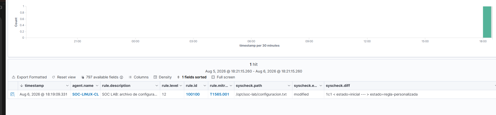
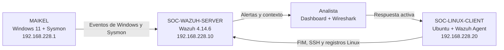
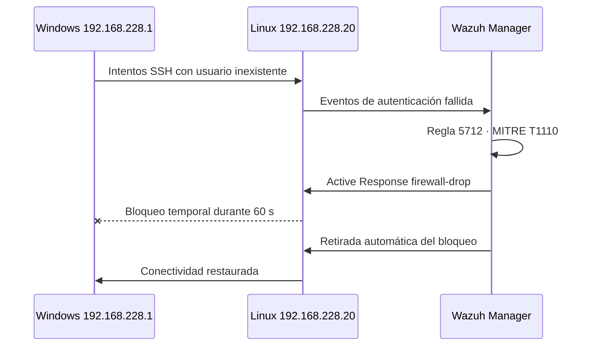

# Miguel Pinedo · Portafolio de Ciberseguridad


Portafolio personal centrado en ciberseguridad defensiva, administración de sistemas y desarrollo web. El proyecto principal es un laboratorio SOC completo con Wazuh, Sysmon, Windows y Linux, documentado con una guía y tres informes de incidentes.

**[Ver la web →](https://mi-portafolio-sepia-xi.vercel.app)** · [Laboratorio SOC](https://mi-portafolio-sepia-xi.vercel.app/proyectos/laboratorio-soc-wazuh) · [Currículum (PDF)](https://mi-portafolio-sepia-xi.vercel.app/assets/CV_Miguel_Pinedo_moderno.pdf) · [Contacto](https://mi-portafolio-sepia-xi.vercel.app/contacto)

> Todo el contenido del laboratorio se generó en un entorno propio, aislado y autorizado. El repositorio no contiene contraseñas ni credenciales del despliegue.

## Laboratorio SOC con Wazuh



El laboratorio reproduce el flujo de trabajo de un analista defensivo: recolección de telemetría, detección, investigación, correspondencia con MITRE ATT&CK, contención y documentación profesional.

### Guía e informes

| Documento | Contenido |
| --- | --- |
| [Guía visual del laboratorio](https://mi-portafolio-sepia-xi.vercel.app/proyectos/laboratorio-soc-wazuh/informe/guia-lab-soc-wazuh) | Montaje paso a paso, endpoints, bitácora y detecciones |
| [SOC-2026-001 · Fuerza bruta SSH](https://mi-portafolio-sepia-xi.vercel.app/proyectos/laboratorio-soc-wazuh/informe/incidente-ssh-soc-2026-001) | Detección, respuesta activa y correlación con Wireshark |
| [SOC-2026-002 · PowerShell codificado](https://mi-portafolio-sepia-xi.vercel.app/proyectos/laboratorio-soc-wazuh/informe/incidente-powershell-soc-2026-002) | Comando Base64 detectado por Sysmon y Wazuh |
| [SOC-2026-003 · Integridad de archivos](https://mi-portafolio-sepia-xi.vercel.app/proyectos/laboratorio-soc-wazuh/informe/incidente-fim-soc-2026-003) | FIM en tiempo real y regla personalizada 100100 |

Configuración descargable: [regla `fim_soc_lab.xml`](public/config/fim_soc_lab.xml) · [configuración de Sysmon](public/config/sysmon-lab.xml).

### Arquitectura



| Componente | Función | Dirección |
| --- | --- | --- |
| `SOC-WAZUH-SERVER` | Manager, indexer y dashboard de Wazuh | `192.168.228.10` |
| `MAIKEL` | Endpoint Windows con agente Wazuh y Sysmon | `192.168.228.1` |
| `SOC-LINUX-CLIENT` | Endpoint Ubuntu monitorizado con FIM y SSH | `192.168.228.20` |
| VirtualBox Host-Only | Red privada del laboratorio | `192.168.228.0/24` |

### Escenarios validados

| Escenario | Detección | Resultado |
| --- | --- | --- |
| Fuerza bruta SSH | Regla `5712`, nivel 10, MITRE `T1110` | Detectada y contenida durante 60 segundos con `firewall-drop` |
| PowerShell codificado | Regla `92057`, nivel 12, MITRE `T1059.001` | Comando Base64 detectado, decodificado y clasificado |
| Integridad de archivos | Reglas `554`, `550` y `553` | Creación, contenido, atributos y eliminación reconstruidos |
| Correlación de red | Wazuh + Wireshark | Flujo SSH correlacionado por IP, puerto, hora y evento |
| Regla personalizada | Regla `100100`, nivel 12, MITRE `T1565.001` | Prueba positiva correcta y prueba negativa sin falsos positivos |

### Regla personalizada

La regla eleva la severidad únicamente cuando se modifica el archivo protegido del laboratorio. Un archivo diferente dentro de la misma carpeta conserva las reglas estándar y no activa la regla `100100`.

```xml
<group name="syscheck,custom_fim,soc_lab,">
  <rule id="100100" level="12">
    <if_sid>550</if_sid>
    <field name="file" type="pcre2">^/opt/soc-lab/configuracion\.txt$</field>
    <description>SOC LAB: archivo de configuración protegido modificado: $(file)</description>
    <mitre>
      <id>T1565.001</id>
    </mitre>
  </rule>
</group>
```

| Prueba | Archivo | Alertas obtenidas | Conclusión |
| --- | --- | --- | --- |
| Positiva | `configuracion.txt` | `100100`, nivel 12 | La ruta protegida coincide |
| Negativa | `archivo-no-protegido.txt` | `554` y `550` | La regla personalizada no genera ruido |

### Respuesta al incidente SSH



### Evidencias destacadas

| Detección | Evidencia |
| --- | --- |
| Fuerza bruta y respuesta activa | [Alerta 5712](public/assets/lab-soc/evidencias/11-wazuh-fuerza-bruta-5712.png) · [firewall-drop](public/assets/lab-soc/evidencias/12-active-response-firewall-drop.png) |
| PowerShell | [Alerta 92057](public/assets/lab-soc/evidencias/17-wazuh-powershell-92057.png) · [CSV](public/assets/lab-soc/evidencias/18-alerta-powershell-92057.csv) |
| Regla personalizada | [Alerta 100100](public/assets/lab-soc/evidencias/19-regla-personalizada-100100.png) · [CSV](public/assets/lab-soc/evidencias/20-alerta-regla-100100.csv) |
| Prueba negativa | [Reglas estándar 554/550](public/assets/lab-soc/evidencias/22-prueba-negativa-archivo-no-protegido.png) · [CSV](public/assets/lab-soc/evidencias/23-eventos-archivo-no-protegido.csv) |
| Tráfico SSH | [Captura de Wireshark](public/assets/lab-soc/evidencias/10-wireshark-correlacion-ssh.png) · [Correlación Wazuh](public/assets/lab-soc/evidencias/16-correlacion-ssh-wazuh.csv) |

### Capacidades demostradas

- Despliegue y administración de Wazuh en Ubuntu.
- Incorporación de endpoints Windows y Linux.
- Telemetría avanzada de Windows mediante Sysmon.
- Investigación en Threat Hunting y exportación de evidencias.
- Monitorización de integridad de archivos en tiempo real.
- Creación y ajuste de reglas locales de Wazuh.
- Correspondencia prudente con MITRE ATT&CK.
- Respuesta activa, contención temporal y recuperación.
- Correlación entre alertas de endpoint y tráfico de red.
- Elaboración de informes profesionales con hashes SHA-256.

## Otros proyectos

| Proyecto | Descripción | Enlaces |
| --- | --- | --- |
| Lavandería Miguel | Web para una lavandería de autoservicio: servicios, ubicación y contacto | [Demo](https://lavanderia-miguel.vercel.app/) · [Código](https://github.com/mpinedo04/lavanderia-miguel) |
| Portafolio Raúl | Portafolio audiovisual para un filmmaker: perfil, proyectos, equipo y contacto | [Demo](https://portafolio-raul-sigma.vercel.app/) · [Código](https://github.com/mpinedo04/portafolio-raul) |
| VideoBalls Analytics | Web de analítica para visualizar estadísticas y datos | [Demo](https://videoballs-analyticsraulmiguel2.vercel.app/) · [Código](https://github.com/mpinedo04/videoballs-analytics) |

## Sobre la web

- **Next.js 16 con App Router**, desplegada en Vercel. Cada subida a `main` publica una versión nueva.
- **Terminal interactiva en la portada**, con un motor físico propio (`src/components/hero/fieldEngine.js`): la ventana se arrastra, se lanza con inercia y se acopla sola, y las letras del titular reaccionan a ella. Admite comandos como `help`, `whoami`, `ls`, `cd`, `cat skills.txt`, `nmap`, `scan`, `grep`, `echo "…" > tagline`, `encrypt`, `decrypt` o `sudo rm -rf /`.
- **Contenido editable con Sanity** (opcional). Sin configurarlo, la web usa el contenido local de `src/data/`.
- **Informes técnicos** convertidos a JSON a partir de los HTML originales, con botón para imprimir o guardar en PDF.
- **Vista previa al compartir el enlace** (Open Graph): descripción propia por página e imagen generada en el build (`/og-image.png`).
- **Redirecciones** desde las direcciones `.html` de la versión estática anterior, que se puede consultar en el historial de git.
- **Accesibilidad**: los lectores de pantalla leen el texto real del hero y, con movimiento reducido activado, no hay física ni animaciones.
- **Vercel Analytics** para las visitas.

El registro detallado de cambios está en [MEJORAS-ULTIMAS.md](MEJORAS-ULTIMAS.md).

## Desarrollo local

Requiere Node.js 20 o superior.

```powershell
npm install
Copy-Item .env.example .env.local
npm run dev
```

Abre [http://localhost:3000](http://localhost:3000). El panel de edición está en `/admin` y muestra los pasos de configuración si todavía no hay un proyecto Sanity.

| Script | Uso |
| --- | --- |
| `npm run dev` | Servidor de desarrollo |
| `npm run build` · `npm start` | Build de producción y servidor |
| `npm run lint` | ESLint |
| `npm run seed:sanity` | Importa todo el contenido local a Sanity |
| `npm run seed:informes` | Sube a Sanity solo la guía y los informes, sin tocar el resto |

### Variables de entorno

Todas son opcionales: sin ellas, la web funciona con el contenido local.

| Variable | Para qué sirve |
| --- | --- |
| `NEXT_PUBLIC_SITE_URL` | URL pública, usada en la vista previa al compartir. En Vercel, si falta, se usa la URL de producción |
| `NEXT_PUBLIC_SANITY_PROJECT_ID` · `NEXT_PUBLIC_SANITY_DATASET` | Proyecto y dataset de Sanity |
| `NEXT_PUBLIC_SANITY_STUDIO_URL` | Dirección del Studio para la edición visual |
| `SANITY_API_READ_TOKEN` | Vista previa de borradores (rol `Viewer`) |
| `SANITY_API_WRITE_TOKEN` | Solo para los scripts `seed:*` |
| `SANITY_REVALIDATE_SECRET` | Clave del webhook `POST /api/revalidate?secret=…`, que actualiza las páginas al publicar en Sanity |

No compartas ni subas `.env.local`.

## Estructura

```text
.
├── public/
│   ├── assets/                      imágenes, CV e ilustraciones
│   │   └── lab-soc/evidencias/      capturas y CSV del laboratorio
│   └── config/                      fim_soc_lab.xml · sysmon-lab.xml
├── src/
│   ├── app/(website)/               páginas del sitio (App Router)
│   ├── app/(admin)/admin/           Sanity Studio embebido
│   ├── app/api/                     vista previa de borradores y revalidación
│   ├── app/og-image.png/            imagen de vista previa al compartir
│   ├── components/                  cabecera, tarjetas, transiciones…
│   ├── components/hero/             terminal interactiva, comandos y motor físico
│   ├── data/                        contenido local de respaldo e informes en JSON
│   ├── lib/seo.js                   metadatos y Open Graph de cada página
│   └── sanity/                      cliente, consultas y esquemas
├── scripts/seed-sanity.mjs          importa el contenido a Sanity
├── vercel.json                      indica a Vercel que el proyecto es Next.js
└── MEJORAS-ULTIMAS.md               registro de cambios
```

## Tecnologías

`Wazuh` · `Sysmon` · `Ubuntu Server` · `Windows 11` · `VirtualBox` · `Wireshark` · `PowerShell` · `Bash` · `MITRE ATT&CK` · `Next.js` · `React` · `Sanity` · `CSS Modules` · `Vercel`

## Autor

**Miguel Pinedo**

- [Web](https://mi-portafolio-sepia-xi.vercel.app)
- [GitHub](https://github.com/Mpinedo04)
- [Contacto](https://mi-portafolio-sepia-xi.vercel.app/contacto)
- [Currículum](https://mi-portafolio-sepia-xi.vercel.app/assets/CV_Miguel_Pinedo_moderno.pdf)
