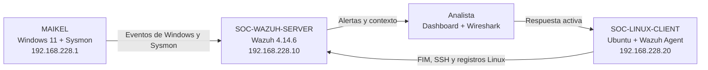
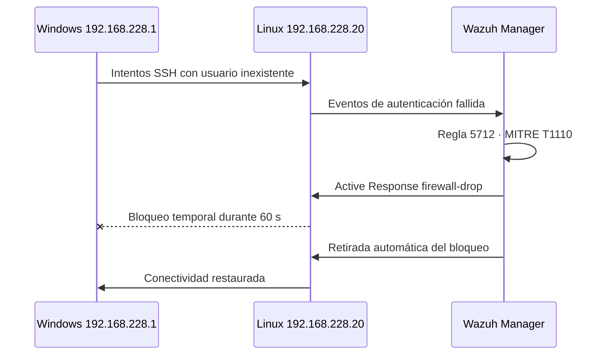

# Miguel Pinedo · Portafolio de Ciberseguridad


Portafolio personal centrado en ciberseguridad defensiva, administración de sistemas y desarrollo web. El proyecto principal es un laboratorio SOC completo con Wazuh, Sysmon, Windows y Linux.

> Todo el contenido del laboratorio se generó en un entorno propio, aislado y autorizado. El repositorio no contiene contraseñas ni credenciales del despliegue.

## Laboratorio SOC con Wazuh


El laboratorio reproduce el flujo de trabajo de un analista defensivo: recolección de telemetría, detección, investigación, correspondencia con MITRE ATT&CK, contención y documentación profesional.

### Accesos rápidos

- [Abrir la guía visual completa](GUIA_LAB_SOC_WAZUH.html)
- [Informe SOC-2026-001 · Fuerza bruta SSH](INFORME_INCIDENTE_SSH_SOC-2026-001.html)
- [Informe SOC-2026-002 · PowerShell codificado](INFORME_INCIDENTE_POWERSHELL_SOC-2026-002.html)
- [Informe SOC-2026-003 · Integridad de archivos](INFORME_INCIDENTE_FIM_SOC-2026-003.html)
- [Regla personalizada 100100](config/fim_soc_lab.xml)

## Arquitectura



| Componente | Función | Dirección |
| --- | --- | --- |
| `SOC-WAZUH-SERVER` | Manager, indexer y dashboard de Wazuh | `192.168.228.10` |
| `MAIKEL` | Endpoint Windows con agente Wazuh y Sysmon | `192.168.228.1` |
| `SOC-LINUX-CLIENT` | Endpoint Ubuntu monitorizado con FIM y SSH | `192.168.228.20` |
| VirtualBox Host-Only | Red privada del laboratorio | `192.168.228.0/24` |

## Escenarios validados

| Escenario | Detección | Resultado |
| --- | --- | --- |
| Fuerza bruta SSH | Regla `5712`, nivel 10, MITRE `T1110` | Detectada y contenida durante 60 segundos con `firewall-drop` |
| PowerShell codificado | Regla `92057`, nivel 12, MITRE `T1059.001` | Comando Base64 detectado, decodificado y clasificado |
| Integridad de archivos | Reglas `554`, `550` y `553` | Creación, contenido, atributos y eliminación reconstruidos |
| Correlación de red | Wazuh + Wireshark | Flujo SSH correlacionado por IP, puerto, hora y evento |
| Regla personalizada | Regla `100100`, nivel 12, MITRE `T1565.001` | Prueba positiva correcta y prueba negativa sin falsos positivos |

## Regla personalizada

La regla eleva la severidad únicamente cuando se modifica el archivo protegido del laboratorio. Un archivo diferente dentro de la misma carpeta conserva las reglas estándar y no activa la regla `100100`.

```xml
<group name="syscheck,custom_fim,soc_lab,">
  <rule id="100100" level="12">
    <if_sid>550</if_sid>
    <field name="file" type="pcre2">^/opt/soc-lab/configuracion\.txt$</field>
    <description>SOC LAB: archivo de configuración protegido modificado: $(file)</description>
    <mitre>
      <id>T1565.001</id>
    </mitre>
  </rule>
</group>
```

### Validación de precisión

| Prueba | Archivo | Alertas obtenidas | Conclusión |
| --- | --- | --- | --- |
| Positiva | `configuracion.txt` | `100100`, nivel 12 | La ruta protegida coincide |
| Negativa | `archivo-no-protegido.txt` | `554` y `550` | La regla personalizada no genera ruido |

## Respuesta al incidente SSH



## Evidencias destacadas

| Detección | Evidencia |
| --- | --- |
| Fuerza bruta y respuesta activa | [Alerta 5712](assets/lab-soc/evidencias/11-wazuh-fuerza-bruta-5712.png) · [firewall-drop](assets/lab-soc/evidencias/12-active-response-firewall-drop.png) |
| PowerShell | [Alerta 92057](assets/lab-soc/evidencias/17-wazuh-powershell-92057.png) · [CSV](assets/lab-soc/evidencias/18-alerta-powershell-92057.csv) |
| Regla personalizada | [Alerta 100100](assets/lab-soc/evidencias/19-regla-personalizada-100100.png) · [CSV](assets/lab-soc/evidencias/20-alerta-regla-100100.csv) |
| Prueba negativa | [Reglas estándar 554/550](assets/lab-soc/evidencias/22-prueba-negativa-archivo-no-protegido.png) · [CSV](assets/lab-soc/evidencias/23-eventos-archivo-no-protegido.csv) |
| Tráfico SSH | [Captura de Wireshark](assets/lab-soc/evidencias/10-wireshark-correlacion-ssh.png) · [Correlación Wazuh](assets/lab-soc/evidencias/16-correlacion-ssh-wazuh.csv) |

## Capacidades demostradas

- Despliegue y administración de Wazuh en Ubuntu.
- Incorporación de endpoints Windows y Linux.
- Telemetría avanzada de Windows mediante Sysmon.
- Investigación en Threat Hunting y exportación de evidencias.
- Monitorización de integridad de archivos en tiempo real.
- Creación y ajuste de reglas locales de Wazuh.
- Correspondencia prudente con MITRE ATT&CK.
- Respuesta activa, contención temporal y recuperación.
- Correlación entre alertas de endpoint y tráfico de red.
- Elaboración de informes profesionales con hashes SHA-256.

## Estructura relevante

```text
.
├── GUIA_LAB_SOC_WAZUH.html
├── INFORME_INCIDENTE_SSH_SOC-2026-001.html
├── INFORME_INCIDENTE_POWERSHELL_SOC-2026-002.html
├── INFORME_INCIDENTE_FIM_SOC-2026-003.html
├── config/
│   ├── fim_soc_lab.xml
│   └── sysmon-lab.xml
└── assets/lab-soc/evidencias/
```

## Tecnologías

`Wazuh` · `Sysmon` · `Ubuntu Server` · `Windows 11` · `VirtualBox` · `Wireshark` · `PowerShell` · `Bash` · `MITRE ATT&CK` · `HTML` · `CSS` · `JavaScript`

## Autor

**Miguel Pinedo**

- [GitHub](https://github.com/Mpinedo04)
- [Contacto](contacto.html)
- [Currículum](assets/CV_Miguel_Pinedo_moderno.pdf)

